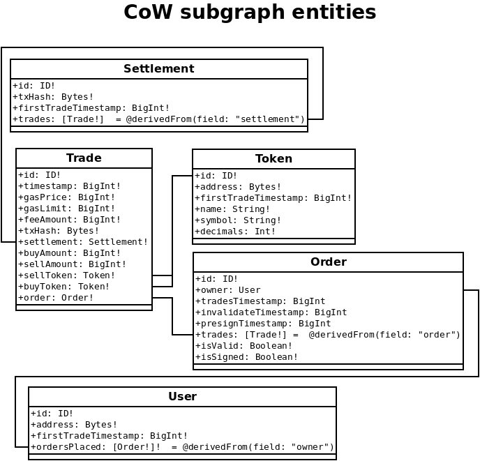

# CoW-subgraph

Implements a subgraph for the [CoW Protocol](https://github.com/gnosis/gp-v2-contracts)

*So far this is a work in progress.*

- [Subgraph on mainnet](https://thegraph.com/hosted-service/subgraph/gnosis/cow)
- [Subgraph on rinkeby](https://thegraph.com/hosted-service/subgraph/gnosis/cow-rinkeby)
- [Subgraph on gnosis chain network](https://thegraph.com/hosted-service/subgraph/gnosis/cow-gc)

For more information about:

The Cow Protocol: https://docs.cow.fi/
The Graph: https://thegraph.com/docs/en/

There is also a GP v1 subgraph here: https://github.com/gnosis/dex-subgraph

## Available entities



### Settlement entity notes

So far settlements are being created using txHash as ID and that hash is creating the relation between Settlement and Trade entities.

### Orders entity notes

Notice order entity has 3 different timestamps. Each timestamp will be filled depending on the entry point that order passed.

**Entrypoints are:**

- On trade event
- On invalidate order event
- On pre sign event

## Setup of your own test subgraph

*Requisites:* You must have access to a console and have yarn installed. More info about [yarn](https://classic.yarnpkg.com/lang/en/docs/)

1. Install the dependencies by executing:

```bash
$ yarn
```

2. Go to The Graph [hosted service](https://thegraph.com/hosted-service/dashboard) and log in using your github credentials. 

3. Copy your access token and run the following:

```bash
$ graph auth --product hosted-service <YourAccessToken>
```

5. In your browser, create a new subgraph in the dashboard by clicking "Add Subgraph" button. Complete the form. Notice your subgraph will be named: `YourGithubAccount/SubgraphName`

6. Create your own environment and edit so it points to your testing subgraph:

```bash
cp .env.example .env
```

7. Deploy:
```bash
yarn deploy
```

If everything went well you'll have a copy of this subgraph running on your hosted service account indexing your desired network.

Please notice a subgraph can only index a single network, if you want to index another network you should create a new subgraph and do same steps starting from step 3.
