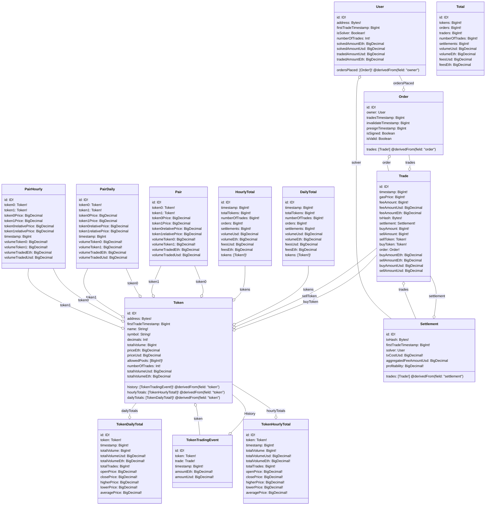

# Model explained

## Available entities

### Settlement entity notes

So far settlements are being created using txHash as ID and that hash is creating the relation between Settlement and Trade entities.

### Orders entity notes

Notice order entity has 3 different timestamps. Each timestamp will be filled depending on the entry point that order passed.

**Entrypoints are:**

- On trade event
- On invalidate order event
- On pre sign event

### About token prices

In token entity you can find prices for each token. It's price it's being calculated using Honeyswap pools prices in gnosis chain or UniswapV3 in ethereum mainnet or rinkeby. 

### About totals

Totals is a singleton entity where it's aggregated information about how many different tokens had been traded, total traded volume in usd and eth, etc. You can find more detailed information in the subgraph schema. Please notice there's also a totals calculated by hour and by day.

### About pairs

Pairs are entities for a pair of tokens that had been traded on our platform. For keeping the tokens ordered in the same way, addresses are being sorted and token0 always stores the lower value and token1 the greater one. Please notice there's also a pairs entity by hour and by day.